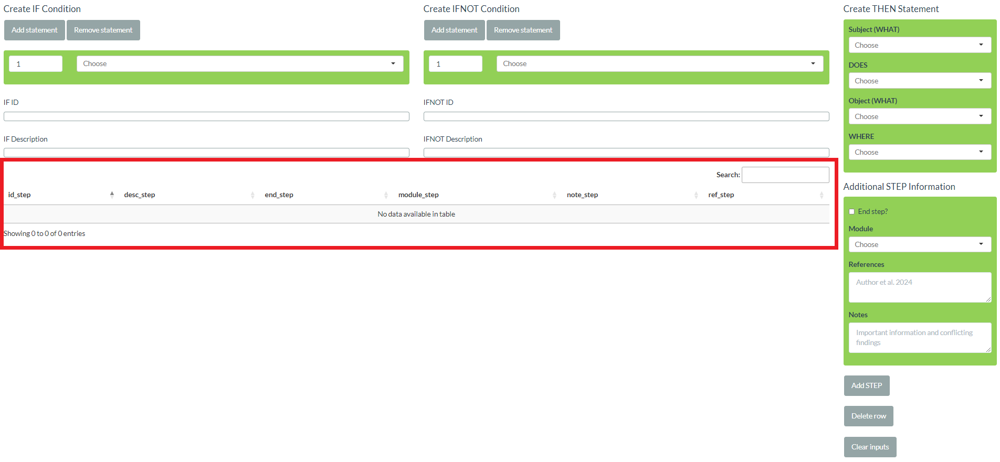

```{r, include = FALSE}
knitr::opts_chunk$set(
  collapse = TRUE,
  comment = "#>"
)
```

```{r setup}
library(epicmodel)
```

In this article, we'll show you how to use the **Steplist Creator `Shiny` App**. Ideally, you have RStudio open and `epicmodel` installed so you can click along with the tutorial.

# Launching the app

First, launch the app with `launch_steplist_creator()`. Unfortunately, in `epicmodel` version 0.1.0, the app is still optimized for a big screen and using it on a laptop might be difficult.

```{r, eval = FALSE}
launch_steplist_creator()
```

# A first look at the app

Before creating a steplist, let's look at the app first. There are 8 elements, i.e., tabs, in the menu at the top. Here's a short description:

-   **START**: Upload and download data
-   **WHAT**: Create and manage WHAT segments
-   **DOES**: Create and manage DOES segments
-   **WHERE**: Create and manage WHERE segments
-   **MODULE**: Create and manage modules
-   **STEP**: Create and manage steps and THEN statements
-   **ICC**: Define incompatible component causes
-   **OUTCOME**: Define outcome definitions

All tabs (apart from `START`) contain basically the same elements:

-   Input fields: When creating new entries, the information is inputted in the input fields. Input fields always have a green background.
-   Action buttons: Buttons for *adding* and *deleting* entries as well as for *clearing*, i.e., returning the input fields to their defaults
-   Table: A table that contains all current entries in a certain tab. Tables can be searched by typing into the search field at the top right of the table. Elements in a table can be edited by double-clicking the corresponding cell. Cells that are automatically filled cannot be edited. These cells are all IDs as well as descriptions of steps and THEN segments. Since tables in tabs ICC and OUTCOME re-use step IDs and descriptions, they cannot be edited at all.

## IDs

IDs are automatically created by the app and follow a pre-defined form:

-   WHAT (id_what): a1, a2, a3, etc.
-   DOES (id_does): d1, d2, d3, etc.
-   WHERE (id_where): e1, e2, e3, etc.
-   MODULE (id_module): m1, m2, m3, etc.
-   ICC (id_icc): i1, i2, i3, etc.
-   THEN (id_then): Combinations of the segment IDs that together form the THEN statement following the `WHAT DOES WHAT WHERE` structure, e.g., `a1d2e1`, `d4a67`, `a2d3a8`. If THEN objects are used, the object ID is put into `()`, e.g., `a1d1(a1d2e1)e1`.
-   STEP (id_step): Combinations of the IDs of THEN statements, the keys `IF`, `IFNOT`, and `THEN`, as well as additional characters indicating AND/OR logic
-   OUTCOME (id_out): Combinations of IDs of THEN statements and additional characters indicating AND logic

## Descriptions

Descriptions are partly provided by the user and partly created automatically. Descriptions in tabs WHAT, DOES, WHERE, and MODULE need to be provided. Descriptions in tab STEP are created automatically. Automatically created descriptions should not completely neglect English grammar. Therefore, WHAT and DOES need to provide slightly more information. Let's take a detailed look at the corresponding fields.

-   Keywords (key_what, key_does, key_where, key_module): All 4 tabs (WHAT, DOES, WHERE, MODULE) need a keyword. In tab STEP, you will later select from these 4 tables with drop-down menus. Keywords are the descriptors that appear in these drop-down menus. So provide values that are not too long but still identifiable. For modules, the keyword is also used in output, e.g., when printing a SCC model.

-   Segment descriptions (desc_what, desc_where): They are used in automatically created descriptions of THEN statements and steps.

-   WHAT plural indicator (plural_what): DOES segments are basically verbs in a sentence and therefore they change based on the sentence's subject. Following the `WHAT DOES WHAT WHERE` structure, the subject is the first WHAT segment. Therefore, WHAT segments need to declare if they are singular or plural. In the app, this is done via a checkbox on tab WHAT. In the table, singular translates to `plural_what == 0` and plural translates to `plural_what == 1`.

-   DOES descriptions (subject_singular_does, subject_plural_does, no_subject_does): If a subject is used that has `plural_what == 0`, the automatically created THEN description uses `subject_singular_does`. If a subject is used that has `plural_what == 1`, the automatically created THEN description uses `subject_plural_does`. If no subject has been specified, i.e., if the THEN statement starts with the DOES segment, `no_subject_does` is used.

-   MODULE description (desc_module): The module description offers you the possibility to describe in more detail, what certain modules refer to, since the keyword needs to be short.

-   THEN objects (then_object_does): The checkbox in tab DOES controls if a DOES segment requires a WHAT object (unchecked) or a THEN object (checked). See `vignette("steplist")` for an explanation. In the table, WHAT objects translate to `then_object_does == 0` and THEN objects translate to `then_object_does == 1`.

## Additional step information

We look at tab STEP in more detail later with the example. There are, however, three more non-drop-down input fields in STEP:

-   End step? (end_step): If the checkbox is checked (`end_step == 1`), the step will be considered for outcome definitions, while steps with unchecked box (`end_step == 0`) won't. Accordingly, steps with (`end_step == 1`) appear in the drop-down-menus in tab OUTCOME, where outcome definitions are created.
-   References (ref_step): Space for literature references
-   Notes (note_step): Space for important information and conflicting findings

## ICC and OUTCOME

In tabs ICC and OUTCOME, steps are selected from the drop-down menus. Therefore, all columns in the tables are automatically created.

# Example

For our example, let's create a SCC model for outcome "student can create SCC models". Before we start, please note, that there are different ways of creating the same steplist, e.g., different segment names, different use of WHAT, DOES, and WHERE, etc.

## Collect information on mechanism

Before launching the Steplist Creator `Shiny` App, you should have already prepared all steps based on the literature, your assumptions, etc. For this example, we'll introduce our assumptions about learning SCC models little by little to make it easier to follow along.

Based on our knowledge and assumptions, a student's ability to create SCC models consists of two parts. First, they need background knowledge on SCC models and, second, they need to know how to create them in practice. Let's start with the background knowledge. Let's assume they know enough theory about SCC models in one of two scenarios:

-   They take the class on SCC models.
-   They read the essential literature, e.g., both Rothman's 1976 paper and Modern Epidemiology (3rd Edition)

## Theory: Segments

Now, we need to put this information in the `WHAT DOES WHAT WHERE` structure. Remember, that we don't have to specify all 4 segments if we don't need them. Let's start by identifying WHAT segments, i.e., people, things, concepts, etc.:

-   student
-   class on SCC models
-   essential literature
-   Rothman's 1976 paper
-   Modern Epidemiology (3rd Edition)
-   theory

Now, let's identify DOES segments, which are basically the verbs:

-   take
-   read
-   know

We don't need any WHERE segments for now.

So let's put these segments into the app. Let's start with WHAT segments. Here are the basic tasks:

1.  Go to tab `WHAT`
2.  Type in a new keyword (remember, keywords appear in the drop-down menus)
3.  Type in a new description (remember, descriptions will later form the actual step descriptions)
4.  Select if the segment is singular or plural
5.  Click `Add WHAT segment`
6.  Repeat steps 2-5 for every segment

We suggest the following values but make adjustments, if you want to:

| Keyword              | Description                       | Plural? |
|----------------------|-----------------------------------|---------|
| student              | student                           | No      |
| SCC class            | a class on SCC models             | No      |
| essential literature | essential literature              | No      |
| Rothman (1976)       | Rothman's 1976 paper              | No      |
| ME3                  | Modern Epidemiology (3rd Edition) | No      |
| theory               | theory                            | No      |

Also, you can delete entries from the table following these tasks:

1.  Go to tab `WHAT`
2.  Click `Delete row`
3.  In the pop-up, type in the ID of the corresponding row, e.g., `a1`, and click `OK`

You can delete from the other tables the same way. The WHAT table should now look like this.

```{r out.width = '50%', echo = FALSE}

```

Let's do the same for our DOES segments. Here are the tasks:

1.  Go to tab `DOES`
2.  Type in a new keyword
3.  Type in the version for subjects in singular
4.  Type in the version for subjects in plural
5.  Type in the version for missing subjects, i.e., the version that is used if no subject has been specified
6.  Select if the segment needs a THEN object
7.  Click `Add DOES segment`
8.  Repeat steps 2-7 for every segment

We suggest the following values but make adjustments, if you want to. Please note, that we used `NA` in `no_subject_does` because we expect that none of our verbs will be used without subject. In such a case, we recommend to still assign a value, e.g. `NA`, instead of leaving it empty. Remember that, in case you misspell something, you can edit entries by double-clicking on the corresponding cell.

If you need `no_subject_does` in one of your projects, e.g., for DOES segments "exposure" or "intervene", try the values "exposure to" or "intervention by".

+------------+-------------+-------------+-------------+--------------+
| Keyword    | Description | Description | Description | THEN object? |
|            |             |             |             |              |
|            | Singular    | Plural      | No subject  |              |
+============+=============+=============+=============+==============+
| take       | takes       | take        | NA          | No           |
+------------+-------------+-------------+-------------+--------------+
| read       | reads       | read        | NA          | No           |
+------------+-------------+-------------+-------------+--------------+
| know       | knows       | know        | NA          | No           |
+------------+-------------+-------------+-------------+--------------+

The table should now look like this:

```{r out.width = '70%', echo = FALSE}
knitr::include_graphics("img/epicmodel_app_tutorial_does1.png")
```

## Modules

Before creating steps, let's first add some modules. The tasks are similar to `WHAT` and `DOES` segments:

1.  Go to tab `MODULE`
2.  Type in a new keyword (keywords appear in drop-down menus and `epicmodel` output)
3.  Type in a new description (descriptions are more detailed labels)
4.  Click `Add Module`
5.  Repeat steps 2-4 for every module

We suggest the following modules:

| Keyword  | Description |
|----------|-------------|
| theory   | theory      |
| practice | practice    |

The table now looks like this:

```{r out.width = '50%', echo = FALSE}

```

## STEP tab

Let's now finally take a closer look at tab STEP. In the bottom left, you can see the table that later will contain the steps. All other elements are just there for getting new entries into this table.

```{r out.width = '70%', echo = FALSE}

```

A step contains a THEN segment and potentially IF and/or IFNOT conditions. THEN statements can be created in the "Create THEN Statement" block. The structure follows the `WHAT DOES WHAT WHERE` structure. You may see that the heading of the third drop-down menu is "Object (WHAT)" by default. If you select a DOES segment with `then_object_does == 1` the drop-down menu will automatically change to "Object (THEN)".

```{r out.width = '70%', echo = FALSE}
knitr::include_graphics("img/epicmodel_app_tutorial_step2.png")
```

In the top right corner, you can see two empty fields called "THEN ID" and "THEN Description". These fields will preview ID and description based on the currently selected elements in the "Create THEN Statement" block. So take a look before clicking "Add".

Below the THEN preview fields, you can find the THEN action buttons "Add" and "Delete". They add to and delete from the THEN table, which is located below in the bottom right corner. The THEN table is the source for the drop-down menus for IF/IFNOT creation as well as "Object (THEN)". In addition, some `epicmodel` functions use it for merging descriptions to THEN IDs. Normally, you should not need the THEN action buttons because if you add a step, the corresponding THEN statement is automatically added to the THEN table as well (if not already available) and can then be used in the mentioned drop-down menus.

```{r out.width = '70%', echo = FALSE}
knitr::include_graphics("img/epicmodel_app_tutorial_step3.png")
```

Below the "Create THEN Statement" block are input fields for additional step information, including the module. Below are the action buttons, which add to and delete from the step table in the bottom left corner. As mentioned, if the THEN statement is not yet in the THEN table in the bottom right, it is added to it when adding the step. Finally, the "Clear" button puts all input fields back to its default values.

```{r out.width = '70%', echo = FALSE}
knitr::include_graphics("img/epicmodel_app_tutorial_step4.png")
```

Finally, we have the "Create IF Condition" and "Create IFNOT Condition" blocks in the top left. Both are identical in structure. IF and IFNOT conditions are a combination of an unlimited number of THEN statements. By default, one row for the selection of a THEN statement is displayed. By clicking "Add statement", a new row can be added. Clicking "Remove statement" deletes the last row. If "Remove statement" is clicked when only one row is displayed, it clears the selection back to the default values. Each row consists of a drop-down menu listing all THEN descriptions and of a numeric input. The numeric input indicates the **scenario**. All statements with the same number are part of the same scenario. All statements within the same scenario are combined with AND, i.e., all of them have to be present in order for the STEP to occur (IF) or not to occur (IFNOT). The different scenarios are combined with OR, i.e., only one scenario has to be fulfilled in order for the STEP to occur (IF) or not to occur (IFNOT). Below, the input rows, there is a preview section for IDs and descriptions.

```{r out.width = '70%', echo = FALSE}

```

## Theory: Steps

Now, let's put in the steps we have so far. Let's start with the component causes, i.e., the steps without IF conditions (there are no interventions in this example).

-   student takes a class on SCC models
-   student reads Rothman's 1976 paper
-   student reads Modern Epidemiology (3rd Edition)

Here are tasks to enter the first step:

1.  Go to tab `STEP`
2.  Select "student" in drop-down menu "Subject (WHAT)"
3.  Select "take" in drop-down menu "DOES"
4.  Select "SCC class" in drop-down menu "Object (WHAT)"
5.  Look at the ID and description preview
6.  Select module "theory" in drop-down menu "Module"
7.  Click the "Add" button below "Actions: STEP", not below "Actions: THEN" (see screenshot below)

```{r out.width = '40%', echo = FALSE}
knitr::include_graphics("img/epicmodel_app_tutorial_cause1.png")
```

Now, put in the other two steps. The step table should now look like this:

```{r out.width = '90%', echo = FALSE}

```

It's finally time to create our first IF conditions. The following two steps are still missing:

-   IF student reads Rothman's 1976 paper AND student reads Modern Epidemiology (3rd Edition) THEN student reads essential literature
-   IF student reads essential literature OR student takes a class on SCC models THEN student knows theory

Here are the tasks for the first step:

1.  Select "student" in drop-down menu "Subject (WHAT)"
2.  Select "read" in drop-down menu "DOES"
3.  Select "essential literature" in drop-down menu "Object (WHAT)"
4.  Select module "theory" in drop-down menu "Module"
5.  Since we have two elements in the IF condition, click "Add statement" below "Create IF condition"
6.  Select "student reads Rothman's 1976 paper" in the first drop-down below "Create IF condition"
7.  Select "student reads Modern Epidemiology (3rd Edition)" in the second drop-down below "Create IF condition"
8.  Look at the "IF ID" and "IF Description" preview
9.  Click the "Add" button below "Actions: STEP"

```{r out.width = '50%', echo = FALSE}
knitr::include_graphics("img/epicmodel_app_tutorial_cause3.png")
```

Here are the tasks for the second step:

1.  Select "student" in drop-down menu "Subject (WHAT)"
2.  Select "know" in drop-down menu "DOES"
3.  Select "theory" in drop-down menu "Object (WHAT)"
4.  Select module "theory" in drop-down menu "Module"
5.  Check the box "End step?" because we want to use this step later during outcome definition
5.  Since we have two elements in the IF condition, click "Add statement" below "Create IF condition"
6.  Select "student reads essential literature" in the first drop-down below "Create IF condition"
7.  Select "student takes a class on SCC models" in the second drop-down below "Create IF condition"
8.  Look at the "IF ID" and "IF Description" preview and you will see that both conditions are combined with AND
9.  To combine them with OR, change the second number from 1 to 2
10. Click the "Add" button below "Actions: STEP"

```{r out.width = '50%', echo = FALSE}

```

The steps table should now look like this:

```{r out.width = '90%', echo = FALSE}
knitr::include_graphics("img/epicmodel_app_tutorial_cause5.png")
```

**A word of caution**: If you would now go back and edit the descriptions in tables WHAT, DOES, and WHERE, the step descriptions and THEN statements will **not** update automatically!

## Practice: Assumptions, segments, and steps

Let's assume they know enough about the practice of SCC model creation if they read the `epicmodel` articles on the homepage and if these articles are good.

Again, let's identify the segments. We could, e.g., define "on the homepage" as a WHERE segment. We suggest for the WHERE table:

| Keyword  | Description     |
|----------|-----------------|
| homepage | on the homepage |

With what you learned so far, try to put the WHERE segment into the corresponding table. Then try to identify the WHAT and DOES segments yourself. If you're unsure, you can look at some screenshots at the end of the tutorial.

Next we need to include the steps. First, include the two without IF condition:

-   they read the `epicmodel` articles on the homepage
-   these articles are good

Then, include the one with the IF condition:

-   if they read the `epicmodel` articles on the homepage and if these articles are good then they know enough about the practice of SCC model creation

Again, you can find a screenshot with our solution at the and of the article.

## Outcome definition

Finally, let's specify the outcome definition. Tab OUTCOME works very similar to how you specify IF/IFNOT conditions. You can, e.g., add and remove statements with buttons "Add statement" and "Remove statement". However, you can only select from a subset of steps and the numbers, which represent the scenarios, are missing. When creating the outcome definition, you can only choose from end steps, i.e., those steps, for which you specified `end_step == 1` in the step table in tab STEP. Regarding scenarios, they still exist but are specified differently. Every line in the outcome definitions table is in fact it's own scenario. This means that all end steps you specify together are combined with AND logic in one line. And all lines are combined with OR logic. We have only a single scenario in our outcome definition and, therefore, we only need a single line. Here are the tasks to specify outcome definition "student knows theory and student knows practice":

1.  Go to tab `OUTCOME`
2.  Click on "Add statement" to add a second line
3.  Select "student knows theory" in the first drop-down
4.  Select "student knows practice" in the second drop-down
5.  Click "Add"

```{r out.width = '50%', echo = FALSE}

```

```{r out.width = '70%', echo = FALSE}

```

As an exercise, try to specify an alternative outcome definition: "student knows theory OR student knows practice". You can again find the solution at the end of this article.

## Save steplist

As your final action, you want to download the steplist. If you would close the app now, your progress would be lost. Here are the tasks:

1.  Go to tab `START`
2.  Click on "Download Steplist"
3.  Select the folder and save it
4.  Back in R, you can load it with `readRDS()`

Also, if you want to continue creating your steplist at another day, save it as described and conduct the following tasks:

1.  Start a new session
2.  Launch app
3.  Stay on tab `START`
4.  Click on "Upload Steplist"
5.  Select your previously saved steplist from the folder

# Solutions

## Practice: Segments

Did you remember to enter `epicmodel articles` as **plural**?

```{r out.width = '70%', echo = FALSE}
knitr::include_graphics("img/epicmodel_app_tutorial_what2.png")
knitr::include_graphics("img/epicmodel_app_tutorial_does2.png")

```

## Practice: Steps

Did you remember to check **"End step?"** for `student knows practice`?

```{r out.width = '90%', echo = FALSE}
knitr::include_graphics("img/epicmodel_app_tutorial_cause6.png")
```

## Alternative outcome definition

Outcome definition: student knows theory OR student knows practice

```{r out.width = '70%', echo = FALSE}
knitr::include_graphics("img/epicmodel_app_tutorial_outcome3.png")
```
