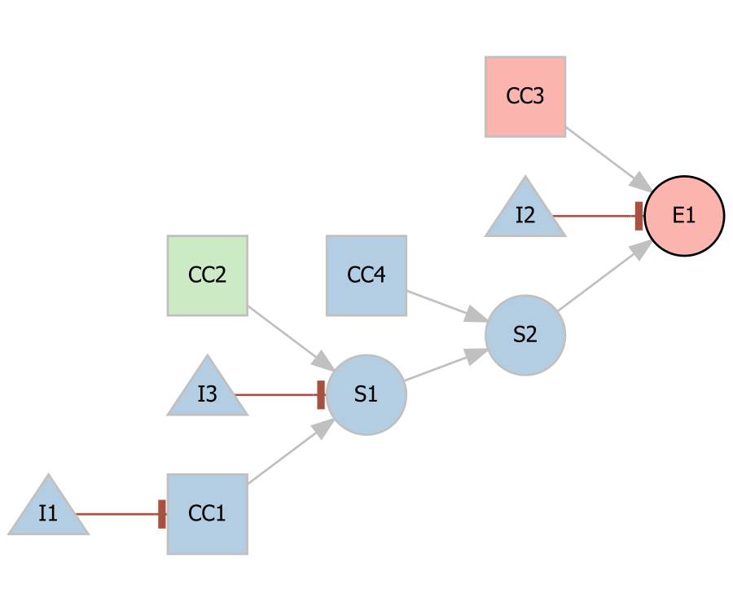
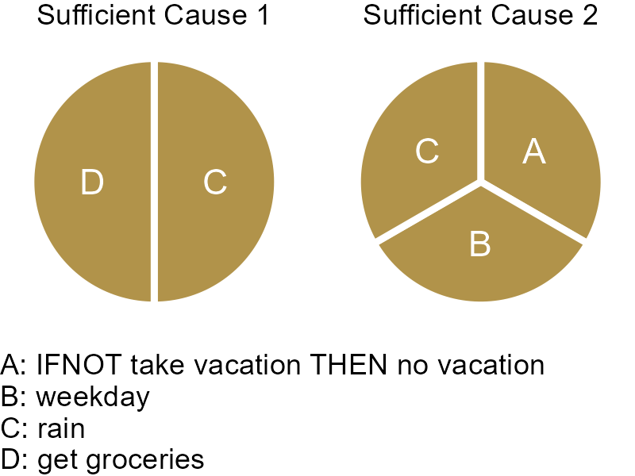
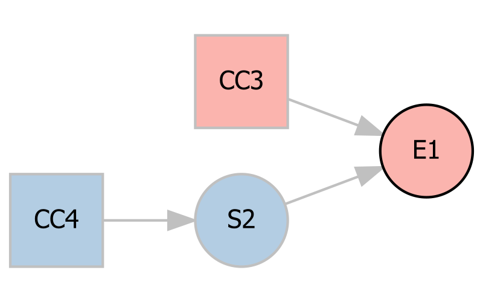
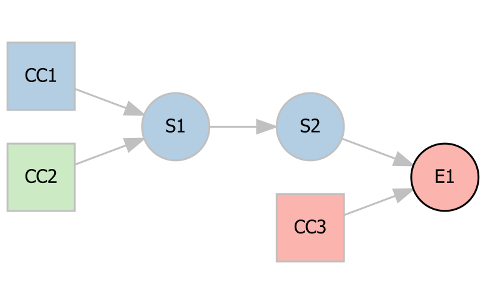
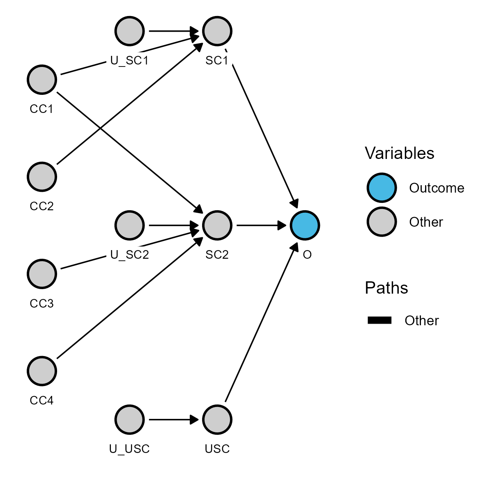

```{r, include = FALSE}
knitr::opts_chunk$set(
  collapse = TRUE,
  comment = "#>"
)
```

```{r setup}
library(epicmodel)
```

In this vignette, we describe the general workflow for sufficient-component cause (SCC) model creation with `epicmodel`. But first of all, if you haven't done so, read Rothman's paper (Rothman 1976)!

# Step 1: Create steplist

The **steplist** is the input from which the SCC model is created. The steplist contains many steps that together form the mechanisms of outcome occurrence. These steps are basically IF/THEN-statements and can be chained together to form mechanisms, e.g., *IF cell A produces cytokine X THEN cell B produces cytokine Y =\> IF cell B produces cytokine Y THEN cell C produces cytokine Z*. To learn why SCC models are based on these steps and how their exact structure looks like, see `vignette("steplist")`.

For the purpose of this introduction, it is enough to know that steps need a very specific structure in order to enable automatic SCC model creation. `epicmodel` therefore provides the **Steplist Creator `Shiny` App**, which helps creating a steplist that has the necessary structure. You can launch the `shiny` app with:

```{r, eval = FALSE}
launch_steplist_creator()
```

Throughout this introduction, we will use the built in `steplist_rain`.

```{r}
steplist <- steplist_rain
```

`steplist_rain` is a dummy example and describes ways of getting wet. Let's first inspect the steplist using `print()`.

```{r}
print(steplist)
```

Print tells us what the steplist contains. Again, see `vignette("steplist")` to find out what all these different things are. 

You can see two important things. First, the steplist contains only 10 steps, which shows that it's probably not a realistic example. Second, the first line tells you that the steplist is "unchecked" and asks you to run `check_steplist()`. `check_steplist()` ensures that the steplist's structure is fine for SCC model creation.

```{r}
steplist_checked <- check_steplist(steplist)
```

You can see from the output that `check_steplist()` conducts many checks. See the function documentation for a detailed description. In our case, all checks have been successful and therefore our steplist is now "checked". When running `print()` again, you will see a confirmation.

```{r}
print(steplist_checked)
```

With a checked steplist, you can also use `summary()` and `plot()`. Let's start with `summary()`:

```{r}
summary(steplist_checked)
```

The output contains the outcome definition as well as all the steps split into different types: Component causes, Interventions, End steps, and Other steps. `vignette("steplist")` will tell you more about these different types of steps. Now, let's try `plot()`.

```{r, eval = FALSE}
plot(steplist_checked)
```

```{r out.width = '70%', echo = FALSE}

```

```{r, echo = FALSE}
out <- plot(steplist_checked)
out$Legend
```

`plot()` shows you how your steps are chained together. The graph is created using the `DiagrammeR` package. The legend shown below the graph links the node labels to your steps and tells you to which **module** a step belongs. Steps that belong together can be grouped into modules when creating the steplist. The node colors in the graph, e.g., depend on the step's module. See `vignette("modules")` to learn more. Later, we will see similar mechanisms for every sufficient cause.

# Step 2: Create SCC model from steplist

But first, we need to actually create the SCC model. This is done by function `create_scc()`. See the function documentation to learn more about the applied algorithm. It only has a single input: the checked steplist.

```{r}
scc_model <- create_scc(steplist_checked)
```

As our steplist is very small, SCC model creation is fast. However, with realistic steplists, `create_scc()` can take some time because it evaluates every possible combination of component causes. From the output we see that 15 sets of component causes have been checked. When running `summary(steplist_checked)` before, we saw that there are 4 component causes. Because every one of them can be present or absent, we have `2 ^ 4 = 16` combinations. Of course, there's no need to evaluate the set where all component causes are absent, which leaves us with 15 combinations. We can further see that 5 of these 15 combinations were sufficient, i.e., fulfilled the outcome definition. We ignore the "Check if sufficiency depends on IFNOT conditions" for this introduction, but you can learn more from `vignette("scc")`. Finally, we see that 2 out of the 5 sufficient causes are minimal. For a set of component causes to form a sufficient cause, it needs to be minimally sufficient, i.e., if you would remove any of its component causes, the remaining ones would not be sufficient any more. In our example, you will see shortly that component causes "rain" and "get groceries" is sufficient to "get wet". If it would not be raining or if you would not go outside to get groceries, you would not get wet. Therefore, it is minimally sufficient. If you add another component cause, e.g., it's a "weekday", to the set, it would of course still lead to the outcome but it would not be minimally sufficient anymore. Now, let's inspect our SCC model using `print()` or `summary()`, which are identical for SCC models.

```{r}
print(scc_model)
```

In the output, we are first reminded of our outcome definition before the sufficient causes (SC) are listed. As we saw before, there are two of them: SC 1 & SC 2. Both sufficient causes are reported to be "Always sufficient". This refers to their **sufficiency status**. Due to the structure of steplists, it is possible that sets of component causes are sufficient, i.e., lead to the outcome, only under some specific circumstances. To learn more, see `vignette("scc")`. This is, however, not the case here. Based on our steplist, both sets of component causes, i.e. "rain" & "get groceries", as well as "no vacation" & "weekday" & "rain" are always sufficient to cause outcome "you get wet". Modules also make an appearance here. Again, see `vignette("modules")` to learn more.

# Step 3: Use SCC model

Learning about sufficient causes is interesting, but we can do a lot more with our SCC model.

## Causal pies

First, of course, we want to see some causal pies, for which we can simple use `plot()`. You'll notice that we additionally specified `unknown = FALSE`. This argument controls if unknown causes are included in the plot. To learn more about unknown causes, see `vignette("scc")`.

```{r, eval = FALSE}
plot(scc_model, unknown = FALSE)
```

```{r out.width = '70%', echo = FALSE}

```

## Standardized effect size

In epidemiology, we usually calculate risk ratios or odds ratios to estimate the strength of the effect of the exposure on the outcome. We learn from SCC models, however, that these effect sizes are no natural constants but that their value depends on the population under study. `epicmodel` offers a function to derive a **standardized effect estimate** from the SCC model. Let's look at the output to explore how it works.

```{r}
effect_size(scc_model)
```

From the output, we see that `epicmodel` calculates a value for each component cause. To do this, it lists all possible sets of component causes (there are 16 of them as we already calculated), splits them into the half where the component cause of interest is present and the half where the component cause of interest is absent, and records the sets that would cause the outcome for each half. Let's look, e.g., at the square brackets `[]` for "get groceries": The first part records sets with "get groceries" present and 4 of the 8 lead to the outcome. The second part records sets without "get groceries" and only 1 of the 8 leads to the outcome. The number in front is simply the ratio of these two fractions. You can see that the standardized effect size for "get groceries" with 4.00 is higher than for "no vacation" or "weekday" with 1.50, which makes sense because "get groceries" only needs "rain" to be sufficient, while "no vacation" and "weekday" need "rain" as well as each other. "rain" is marked as a necessary cause because none of the 8 sets of component causes that do not include "rain" lead to outcome occurrence.

## Mechanisms

When printing our SCC model, we saw that "no vacation", "weekday", and "rain" together formed a sufficient cause. Maybe you wondered, how the three of them would cause "you get wet"? We can explore further by inspecting the **mechanisms**. We already saw the complete one when plotting our steplist. Using `mechanism()`, we can split them up by sufficient cause. Using `plot()`, produces one graph for every sufficient cause. using `print()` provides us with the legend we already know from earlier. Graphs can be downloaded with `export_mechanism()`.

```{r, eval = FALSE}
mech <- mechanism(scc_model)
print(mech)
plot(mech)
```

```{r, echo = FALSE}
mech <- mechanism(scc_model)
print(mech)
```

```{r out.width = '70%', echo = FALSE}


```

## Interventions

Let's take another look at our steplist summary:

```{r}
summary(steplist_checked)
```

You can see that three steps are listed as **interventions**, "take vacation", "take umbrella", and "work from home". For now, we don't need to now, how interventions are defined exactly (again, see `vignette("steplist")` for the details), but from their names we can see that they are actions which might prevent the outcome. `epicmodel` can investigate their impact based on your SCC model. In general, there are two directions such an investigation can take:

-   Which sufficient causes can be prevented by a given intervention?
-   Which intervention prevents the outcome for an individual with a given set of component causes?

Let's investigate first, which sufficient causes can be prevented by intervention "work from home". We specify `"all"` for argument `causes` and `"THENd4e1"`, i.e., the step ID for intervention "work from home", for argument `intervention`.

```{r}
intervene(scc_model, causes = "all", intervention = "THENd4e1")
```

In the output, we get a comparison of the status without and with intervention for each sufficient cause. For Cause Set 1, it is reported that "No considered intervention is able to prevent the outcome", but for Cause Set 2, there is complete prevention by intervention set "work from home".

Now, let's imagine you are in the following situation: it's raining, it's a weekday, you have vacation, but want to get some groceries, i.e., `c("THENa1","THENa5","THENd2a3")` in step IDs. Since you are open to all suggestions, let's specify `"all"` for argument `intervention`.

```{r}
intervene(scc_model, causes = c("THENa1","THENa5","THENd2a3"), intervention = "all")
```

Surprise, you can completely prevent getting wet by taking an umbrella! Please note that `epicmodel` reports only minimal intervention sets. You could, e.g., additionally work from home (even though it doesn't really make sense in this example) and still prevent getting wet. However, you only need to take the umbrella. For a better example, consider the following situation: it's raining, it's a weekday, you don't have vacation, and you don't have an umbrella. We can look at this scenario with:

```{r}
intervene(scc_model, causes = c("IFNOTd6a6THENd5a6","THENa5","THENa1"), intervention = c("THENd6a6","THENd4e1"))
```

The output shows that, to prevent the outcome, you can either work from home or take vacation. Both together would work as well, of course, but again, this intervention set is not minimal.

## DAGs

Finally, `epicmodel` can transform SCC models to directed acyclic graphs (DAGs) following VanderWeele & Robins (2007).

```{r}
dag <- scc_to_dag(scc_model)
dag$dag
```

Element `dag` of the output contains a `dagitty` object thanks to the `dagitty` package. Printing it prints its `dagitty` model code, which, e.g., can be pasted to DAGitty online on https://www.dagitty.net for further processing. You can also plot `dagitty` objects with `epicmodel`'s `plot_dag()` function, which tries to mimic DAGitty's online layout in a `ggplot` object.

```{r, eval = FALSE}
plot_dag(dag$dag)
```

```{r out.width = '70%', echo = FALSE}

```

## References

-   Rothman KJ (1976): *Causes*. American Journal of Epidemiology 104(6):587-592.
-   VanderWeele TJ, Robins JM (2007): *Directed acyclic graphs, sufficient causes, and the properties of conditioning on a common effect.* American Journal of Epidemiology 166 (9): 1096–1104.
